# refexplorer

Co-citation graph explorer for TAEM's `domain_knowledge` ([ADR-009a](https://github.com/TAEM-DEV/adrs)).

Given an integration task, refexplorer queries **Semantic Scholar**, **OpenAlex** and **CrossRef** for co-citation data, scores the candidate papers by relevance, embeds them with `nomic-embed-text` through the cluster's Ollama, and writes the vectors to the `domain_knowledge` collection in Qdrant, where TAEM's controllers can draw on them during a mission.

## Run it

refexplorer runs as a k3s Job ([`job.yaml`](job.yaml)), built from the [`Dockerfile`](Dockerfile).

| Variable | Default | Purpose |
|---|---|---|
| `TASK_DESCRIPTION` | *(required)* | The integration task to explore |
| `DOMAIN_TAGS` | *(required)* | Comma-separated domain tags |
| `MISSION_ID` | | The mission that triggered this run |
| `OLLAMA_URL` | `http://ollama.fabric-sdk:11434` | Ollama endpoint for embeddings |
| `QDRANT_URL` | `http://qdrant.fabric-sdk:6333` | Qdrant endpoint |
| `REDIS_URL` | `redis://redis-master.fabric-sdk:6379` | Redis for caching |
| `MAX_PAPERS` | `20` | Papers to index per run |
| `SS_RATE_LIMIT` | `1.1` | Seconds between Semantic Scholar calls |

<!-- org-footer -->
---

Part of <a href="https://github.com/TAEM-DEV">TAEM</a> · mission control preflight for software integration · built by <a href="https://github.com/ry-ops">ry-ops</a>

